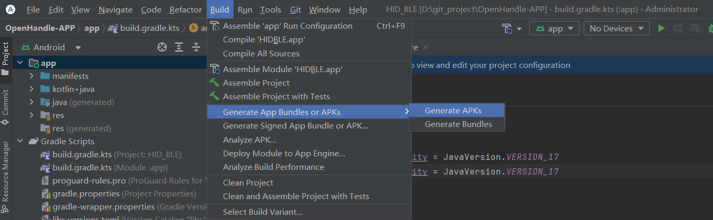

# openHandle-APP

[Readme in English](README_en.md)

<div align="center">

</div>
<p align="center">
👋 Join us on WeChat: hzfaic</a>
</p>

## Project Introduction

OpenHandle-APP is a controller that provides HTTP and SDK interfaces for use by third-party AI large-scale models;

The esp32c3 firmware can replace the capabilities of ADB (Android Debug Bridge) to control devices;

The app provides screen awareness for large-scale models through screenshots.

The Agent can automatically parse intent, understand the current interface, plan the next action, and complete the entire process. The system also has a built-in sensitive operation confirmation mechanism and supports manual intervention in login or CAPTCHA scenarios.

> ⚠️

This project is for research and learning purposes only. It is strictly prohibited to use it for illegal information gathering, system interference, or any illegal activities. Please carefully review the [Terms of Use](resources/privacy_policy.txt).

## Design Principle Diagram


## Verification:

1. If you have ESP32C3 hardware, download the SDK and burn it, or purchase the hardware directly;

2. Install the APK (open source) on your mobile phone;

3. Access the HTTP interface directly in your PC's browser. **(Note: The "Connect Device" interface must be called before other interfaces can be called.)**

## Usage Steps:

1. First, download openHandle-By-Open-AutoGLM (open source).

2. If you have ESP32C3 hardware, download the SDK and flash it, or purchase the hardware directly.

3. Install the APK (open source) on your phone.

4. Connect and control: Demo available.

### Source Code and Firmware:

OpenHandle-By-Open-AutoGLM: https://github.com/Samson1983/OpenHandle-By-Open-AutoGLM

OpenHandle-APP: https://github.com/Samson1983/OpenHandle-APP

App and Firmware Download: https://github.com/Samson1983/OpenHandle-APP/releases

## Quick Compilation

### 1. Open the project in an IDE: such as Android Studio

Just compile and output the APK.



### HTTP Interface (see HttpService.kt)

```kotlin

/**
* Connect to device

* Example URL:

* - http://192.168.0.115:9123/connect?mac=00:11:22:33:44:55 (Connect by specifying MAC address)

* - http://192.168.0.115:9123/connect (Iterate through paired devices to find the UUID for connection)

*/

/**

* Status check

* Example URL: http://192.168.0.115:9123/state

*/

/**

* Click action

* Example URL: http://192.168.0.115:9123/click?x=100&y=500

/
/**
* Long press operation
* Example URL: http://192.168.0.115:9123/press?x=100&y=200&duration=1000

//
/**
* Swipe operation
* Example URL: http://192.168.0.115:9123/swipe?x1=100&y1=100&x2=200&y2=200&duration=1000

//
/**
* Mouse swipe with speed control
* Example URL: http://192.168.0.115:9123/swipe1?x1=100&y1=100&x2=300&y2=300&s=1.5

/
/**

* Copy

* Example URL: http://192.168.0.115:9123/copy

/
/**

* Paste

* Example URL: http://192.168.0.115:9123/paste

/

/**

* Back button

* Example URL: http://192.168.0.115:9123/back

/
@GetMapping("/back")

/**

* ikeyboard - Custom buttons: can implement home, back, recent tasks, etc.

* Example URL: http://192.168.2.99:9123/ikeyboard?key1=0x87&key2=0xB0&duration=100

* ---------Combination Keys-----------

* key1:

* 0x87 = Prefix for triggering these Android special keys (Application key)

* key2:

* 0xB0 = Home

* 0xB1 = Back

* 0xB2 = Menu

* 0xB3 = Recent Apps (Recent Tasks / Multitasking)

*---------Single Key-----------

* key1:

* 0x00 = Function that does not trigger special keys

* key2:

* 0xB0 = Enter; KEY_RETURN

* 0xB2 = Backspace; KEY_BACKSPACE

* 0xB1 = Esc key; KEY_ESC

* 0xB4 = Spacebar; KEY_SPACE_BAR

* 0xD4= KEY_DELETE

*/

/**

* Home key

* Example URL: http://192.168.0.115:9123/home

*/

/**

* Enter key

* Example URL: http://192.168.0.115:9123/enter

*/

/**

* Task key - Enables a natural curve from bottom to top

* Example URL: http://192.168.0.115:9123/recents

*/

/**

* Get phone system information

* Example URL: http://192.168.0.115:9123/systeminfo

*/

/**

* Get app list

* Example URL: http://192.168.0.115:9123/applist

/*

/
* Get current screenshot (returns JSON)

* Example URL: http://192.168.0.115:9123/screenshot

*/

/**
* Get current screenshot (returns image directly)

* Example URL: http://192.168.0.115:9123/screenshot/image

*/

/**
* Input Chinese characters into the phone

* Example URL: http://192.168.0.115:9123/input/text?content=你好世界

*/

/**
* Open an application with a specified package name

* Example URL: http://192.168.0.115:9123/openapp?package=com.example.app

*/

```

## Frequently Asked Questions

We have listed some common questions and their corresponding solutions:

### Screenshot failed (error)

Screenshot permission was disabled;

### Screenshot failed (black screen)

This usually means the application is displaying a sensitive page (payment, password, banking applications). The agent will automatically detect this and request manual intervention.